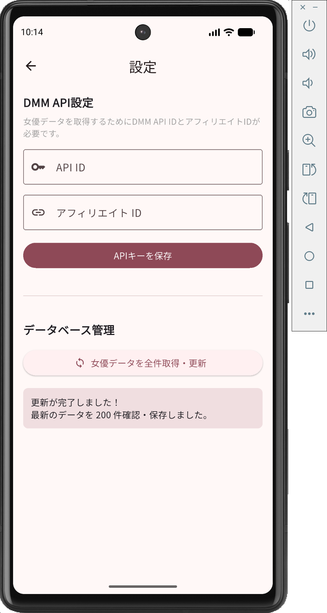
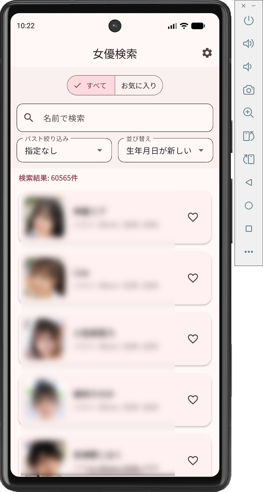

# DMM Actress Search

DMMの膨大な女優データベースをあなたのスマホに。
快適なオフライン検索とお気に入り管理ができる専用アプリ（Android専用）です。

> [!WARNING]
> 本アプリは現在 **Android端末でのみ動作確認** を行っています。iOS等ではご利用いただけません。

## ✨ 特徴
- **爆速のオフライン検索**: アプリ内にデータベースを持つため、通信環境を問わずサクサク検索できます。
- **プライバシー保護**: 起動時の生体認証（FaceID/TouchID等）ロック機能を搭載。安心してご利用いただけます。
- **充実のフィルタリング**: 名前（ひらがな・漢字）での検索はもちろん、バストサイズや生年月日順など、多彩な条件で絞り込み可能です。
- **お気に入り機能**: 気になる女優をワンタップでリスト化。いつでもすぐに探せます。
- **最新出演作品のチェック**: 女優の詳細画面から、最新の出演作品（最大10件）のパッケージ画像と商品URLをすぐに確認できます。

## 📦 インストール方法 (Androidのみ)

本アプリはGoogle Playストアには公開されていません。以下の手順で直接インストールしてください。

1. 本リポジトリの [Releases](https://github.com/nollie540kickflip/actress_search/releases) ページを開きます。
2. 最新バージョンの `Assets` を展開し、`app-release.apk` をタップしてダウンロードします。
3. Android端末上でダウンロードしたAPKファイルを開き、インストールを実行します。
   - ※ ブラウザやファイルマネージャーから開く際に「提供元不明のアプリ」や「Playプロテクト」の警告が出る場合がありますが、そのままインストールを許可してください。
   - ※ 独自の署名キーでビルドされているため、一度インストールすれば次回以降は新しいAPKをダウンロードしてそのまま上書きアップデートが可能です。

## 🚀 使い方（初期設定）

本アプリのご利用には、**DMM APIキー** の取得と設定が必要です。
初回のみ以下の手順を行ってください。

### 1. APIキーの取得
[DMMアフィリエイト](https://affiliate.dmm.com/api/guide/) などのデベロッパー向けページから、無料で以下の2つを取得します。
- **API ID**
- **アフィリエイト ID**

### 2. アプリへの設定とデータの同期
アプリを起動し、右下のタブから「設定画面」を開きます。
取得した **API ID** と **アフィリエイト ID** を入力し、「APIキーを保存」をタップします。

保存後、すぐ下にある「女優データを全件取得・更新」ボタンを押してください。最新の数万件のデータがスマホ内に同期されます（初回は数分程度かかる場合があります）。

### 3. さあ、検索しよう！
トップ画面から、好きな条件で検索やお気に入り登録を活用してください！

---

**🛠 開発者向けの情報**
ソースコードのビルド方法やアーキテクチャについては [DEVELOPMENT.md](DEVELOPMENT.md) をご覧ください。
